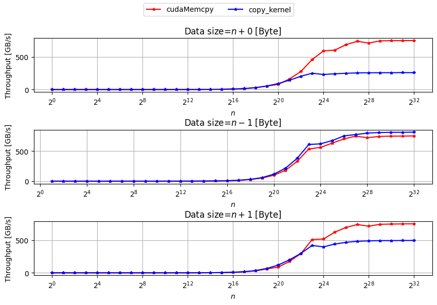
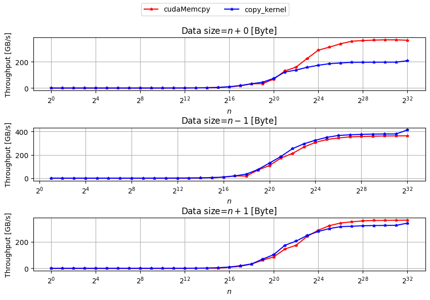

# CUDA device to device memcpy comparison

`cudaMemcpy` vs copy kernel

## Run
```
git clone https://github.com/enp1s0/cuda-dev2dev-comp
cd cuda-dev2dev-comp
make
./d2d-comp.test
```

## Result example

- NVIDIA A100 (40GB SXM4)



- NVIDIA V100 (16GB PCIe)



- NVIDIA GeForce RTX3080 (10GB)


## LICENSE

MIT
